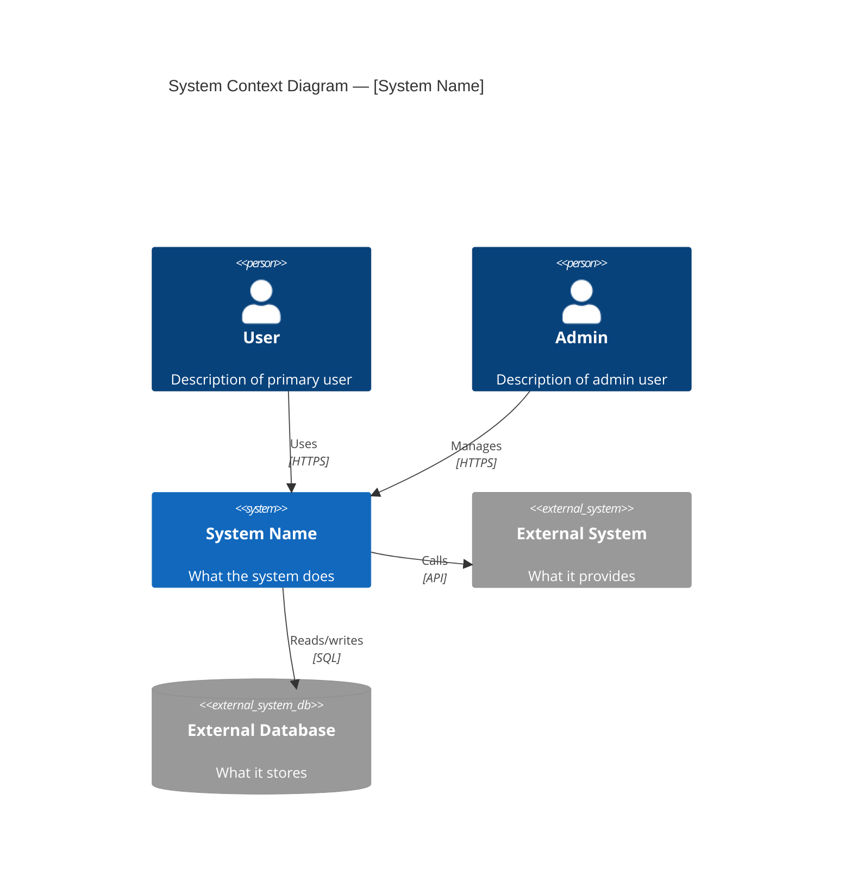
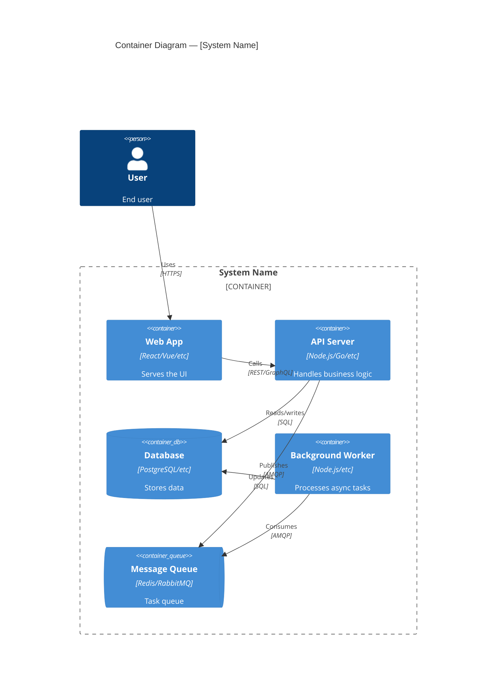
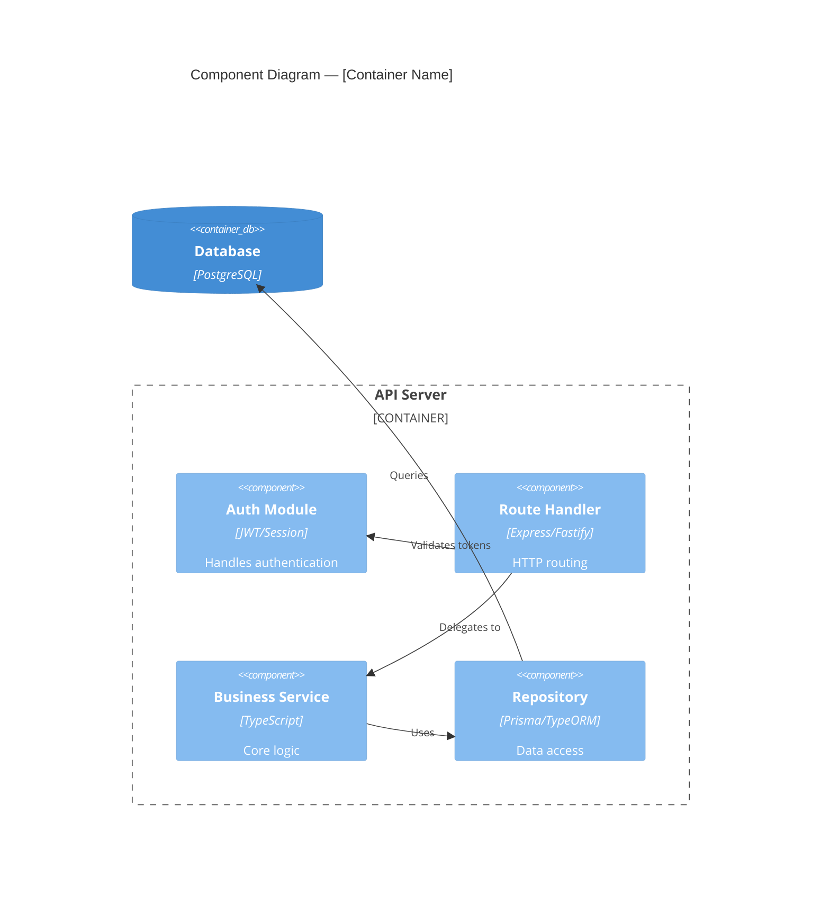
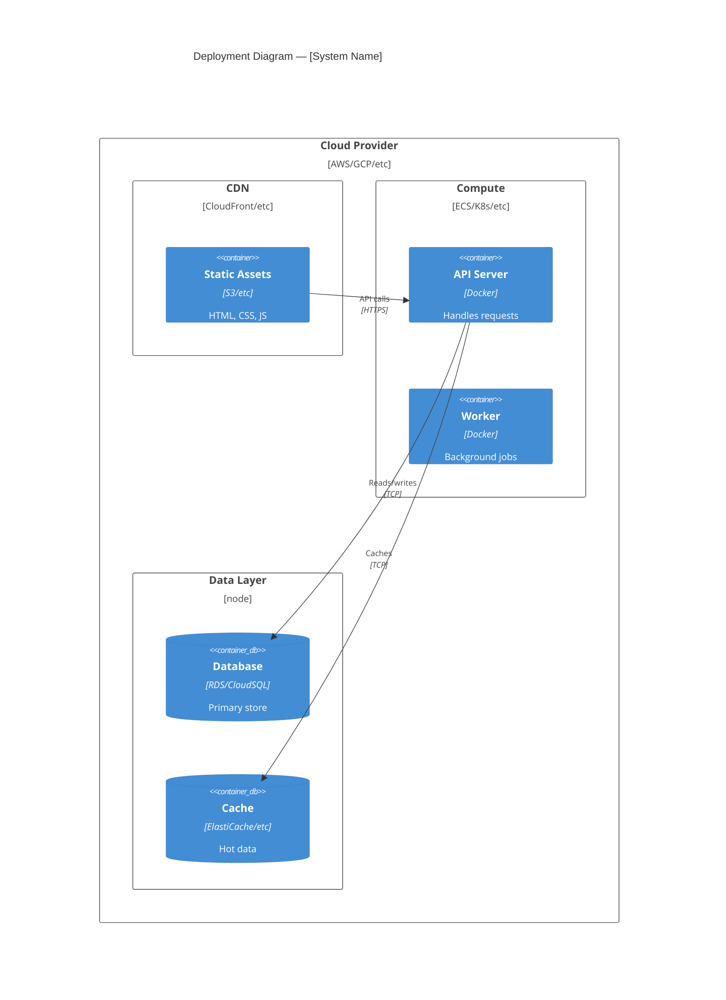
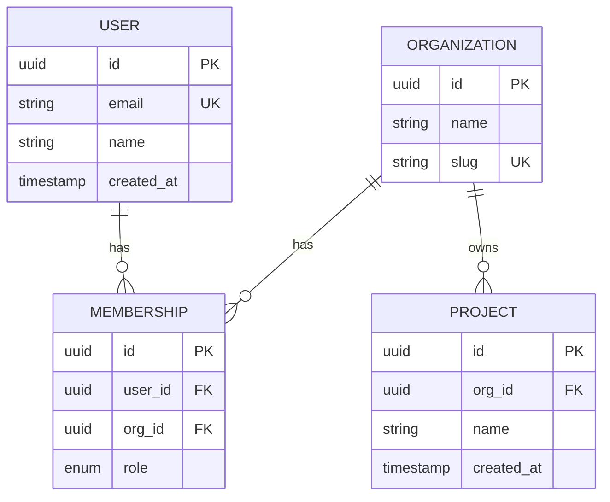
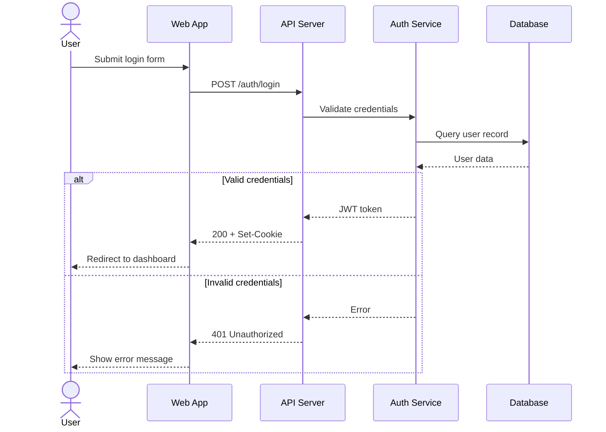
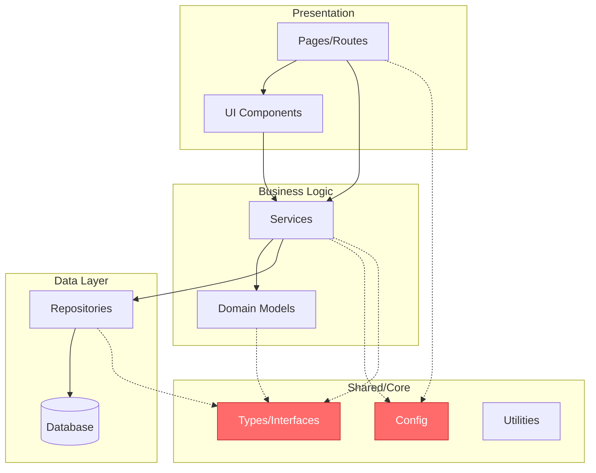
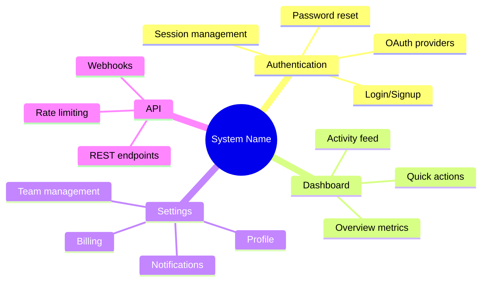

# Architecture Analysis Reference

Techniques for analyzing system structure, dependencies, and component relationships.

## Dependency Mapping

### Forward Dependencies

What a component relies on:
1. **Direct imports** — explicit dependencies in code
2. **Indirect references** — called through interfaces
3. **Runtime dependencies** — configuration, environment
4. **Data dependencies** — shared state, databases

### Reverse Dependencies

What relies on this component:
1. **Direct dependents** — explicit imports from other modules
2. **Interface consumers** — components using this API
3. **Side effect consumers** — code relying on mutations
4. **Event subscribers** — listeners for this component's events

### Circular Dependencies

Red flags:
- A imports B, B imports A
- Longer cycles: A → B → C → A
- Implicit cycles through shared state

Resolution strategies:
- Extract shared code to separate module
- Introduce interface/abstraction layer
- Invert dependency direction
- Break into smaller components

## Layer Identification

### Detecting Layers

Look for:
- **Directional flow** — data/control flows one way
- **Abstraction levels** — concrete → abstract as you ascend
- **Responsibility clustering** — similar concerns grouped
- **Interface boundaries** — clear contracts between groups

### Common Layer Patterns

**Three-tier**:
- Presentation (UI, API endpoints)
- Business logic (domain, workflows)
- Data access (repositories, queries)

**Hexagonal/Clean**:
- Core domain (entities, business rules)
- Application layer (use cases, orchestration)
- Infrastructure (frameworks, external services)
- Interfaces (controllers, adapters)

**Microservices**:
- Service boundary (API gateway)
- Service logic (domain per service)
- Data layer (per-service database)
- Cross-cutting (auth, logging, monitoring)

### Layer Violations

Violations indicate architectural drift:
- Lower layer imports higher layer
- Business logic in presentation layer
- Data access code in domain entities
- Infrastructure concerns leaking into core

## Interface Analysis

### Contract Definition

Examine:
- **Input types** — what does it accept?
- **Output types** — what does it return?
- **Error modes** — what can fail, how?
- **Side effects** — mutations, I/O, state changes
- **Invariants** — what must always be true?

### API Quality Indicators

Strong interfaces:
- **Cohesion** — methods belong together
- **Minimal surface** — small, focused API
- **Clear contracts** — types tell the story
- **Stability** — changes don't cascade
- **Composability** — works well with others

Weak interfaces:
- **Kitchen sink** — unrelated methods bundled
- **Leaky abstractions** — implementation details exposed
- **Unstable** — frequent breaking changes
- **Rigid** — hard to extend or compose

## Component Relationships

### Relationship Types

| Type | Ownership | Lifecycle | Coupling |
|------|-----------|-----------|----------|
| **Composition** | Owns sub-components | Coupled | Strong |
| **Aggregation** | References others | Independent | Loose |
| **Dependency** | Uses interface | No ownership | Can swap |
| **Association** | Knows about | Weak | Bidirectional |

### Coupling Analysis

**Low coupling** (good):
- Communicate through interfaces
- Few shared assumptions
- Changes localized
- Easy to test in isolation

**High coupling** (risky):
- Direct field access
- Shared mutable state
- Knowledge of implementation
- Changes ripple widely

## Hub Detection

Hubs are files/modules with high fan-in (many dependents). They are architectural linchpins.

### Identifying Hubs

1. Count import references for each file using grep/search
2. Rank by number of importers
3. Classify:
   - **Hub** (5+ importers) — important, change carefully
   - **Critical hub** (10+ importers) — core infrastructure, high-risk changes
   - **Leaf** (0-1 importers) — safe to modify in isolation

### Hub Analysis Checklist

For each hub, document:
- What it exports (public API surface)
- Who depends on it (all importers)
- How stable it is (change frequency from git log)
- What would break if it changed (blast radius)
- Test coverage over hub's exports

## Architectural Pattern Recognition

### Layered Architecture

Indicators: Unidirectional dependencies (top → bottom), each layer uses only layer below.
Trade-offs: Simple and well-understood, but can become rigid with performance overhead.

### Event-Driven Architecture

Indicators: Pub/sub or message queues, decoupled components, async communication.
Trade-offs: Scalable and loosely coupled, but harder to reason about flow.

### Microservices

Indicators: Service per bounded context, independent deployment, API-based communication.
Trade-offs: Independent scaling, but distributed system complexity.

## Analysis Workflows

### Top-Down

1. **System boundaries** — what's in scope?
2. **Major components** — high-level modules
3. **Component interactions** — how they communicate
4. **Internal structure** — zoom into each component
5. **Implementation** — code-level details

### Bottom-Up

1. **Entry point** — main(), server start, UI root
2. **Call graph** — trace execution paths
3. **Cluster calls** — group related functionality
4. **Extract components** — identify logical boundaries
5. **Map relationships** — connect the pieces

### Targeted (for specific questions)

1. **Define question** — what are you trying to understand?
2. **Identify relevant code** — where does this happen?
3. **Trace dependencies** — what does it touch?
4. **Analyze impact** — what would changing this affect?
5. **Document findings** — capture insights

## Mermaid Diagram Templates

Ready-to-use templates for visualizing architecture. Replace bracketed placeholders with your system's specifics.

### C4 Context Diagram

Use this to show the big picture: your system, its users, and external dependencies. Start here when explaining a system to stakeholders.

### C4 Container Diagram

Use this to show the major deployable units inside your system. Customize containers to match your actual tech stack.

### C4 Component Diagram

Use this to zoom into a single container and show its internal components. Best for documenting API server internals or complex services.

### C4 Deployment Diagram

Use this to show where containers run in production. Customize cloud provider, services, and infrastructure to match your setup.

### ERD (Entity Relationship Diagram)

Use this to document data models and their relationships. Customize entities, fields, and cardinality for your domain.

### Sequence Diagram

Use this to trace request flows through multiple components. Customize participants and the alt/else blocks for your authentication or business logic flows.

### Dependency Flowchart

Use this to visualize module dependency direction and identify architectural layers. Customize subgraphs and nodes to match your project structure. Hub nodes are highlighted in red.

### Mindmap (Product Features)

Use this for high-level feature mapping or brainstorming. Customize the root and branches to match your product's feature areas.

