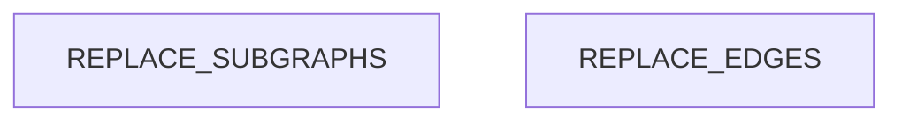

# Dependency Graph

<!-- ORACLE:INSTRUCTIONS
This doc is filled by the structure-analyst.
Maps module-level dependencies, identifies hubs, detects layer violations.

Primary data sources (in order of preference):
1. CodeIndex: docs/codebase_map.json for components, edges, communities, hubs
2. CodeIndex: docs/dependency_graphs/*.json for detailed dependency data
3. Tree-sitter: docs/.tree-sitter-results.json (if exists)
4. Grep: fallback for import statements

IMPORTANT PATHS:
- CodeIndex output is in docs/, NOT .codeindex-cache/
- Static analysis: docs/codebase_map.json
- Dependency graphs: docs/dependency_graphs/*.json
- Interactive viewer: docs/graph.html

codebase_map.json contains:
- nodes: components with metrics (PageRank, fan-in, fan-out, complexity)
- edges: dependency relationships between components
- communities: detected module groupings with keywords

dependency_graph JSON format:
{
  "component.id": {
    "id": "...",
    "name": "...",
    "depends_on": ["other.component.id", ...],
    "file_path": "...",
    ...
  }
}
It's a flat dict keyed by component ID, NOT a graph with nodes/edges arrays.
-->

## Module Dependencies

<!-- ORACLE:DEP_GRAPH
Build a Mermaid flowchart showing how modules depend on each other.

**From codebase_map.json communities:**
```bash
cat docs/codebase_map.json | python3 -c "
import json, sys
data = json.load(sys.stdin)
for comm in data.get('communities', []):
    print(f'{comm[\"name\"]}:')
    print(f'  Components: {comm.get(\"node_count\", 0)}')
    print(f'  Keywords: {comm.get(\"keywords\", [])}')
"
```

**From dependency_graphs/*.json:**
```bash
cat docs/dependency_graphs/*.json | python3 -c "
import json, sys
data = json.load(sys.stdin)
# Format: {component_id: {depends_on: [...]}}
for comp_id, comp_data in list(data.items())[:10]:
    deps = comp_data.get('depends_on', [])
    print(f'{comp_id}: depends on {len(deps)} others')
"
```

**If Tree-sitter exists:**
```bash
cat docs/.tree-sitter-results.json | python3 -c "
import json, sys
data = json.load(sys.stdin)
for edge in data.get('import_graph', {}).get('edges', [])[:10]:
    print(f\"{edge['from']} -> {edge['to']}\")
"
```

Flowchart syntax:
```
flowchart TD
    subgraph LayerName["Display Name"]
        ModuleId[Module Name]
    end
    ModuleA --> ModuleB
    HubModule[Hub Name]:::hub
    classDef hub fill:#ff6b6b,stroke:#c92a2a,color:#fff
```
-->



## Hub Analysis

<!-- ORACLE:HUB_ANALYSIS
For each hub file (5+ dependents), document:
- Dependents: how many files import it
- Stability: how frequently it changes
- Risk: Low/Medium/High/Critical

**From codebase_map.json nodes (find high fan-in components):**
```bash
cat docs/codebase_map.json | python3 -c "
import json, sys
data = json.load(sys.stdin)
nodes = data.get('nodes', [])
hubs = sorted(
    [n for n in nodes if n.get('fan_in', 0) >= 5],
    key=lambda n: n.get('fan_in', 0),
    reverse=True
)[:10]
for h in hubs:
    print(f'{h[\"name\"]}: fan_in={h.get(\"fan_in\",0)}, fan_out={h.get(\"fan_out\",0)}')
"
```

**From dependency_graphs/*.json (if exists):**
```bash
cat docs/dependency_graphs/*.json | python3 -c "
import json, sys
from collections import Counter
data = json.load(sys.stdin)
dependents = Counter()

# Format: {component_id: {depends_on: [...]}}
for comp_id, comp_data in data.items():
    for dep in comp_data.get('depends_on', []):
        dependents[dep] += 1

print('Hub files (5+ dependents):')
for comp, count in dependents.most_common(10):
    if count >= 5:
        print(f'  {comp}: {count} dependents')
"
```

**From Tree-sitter:** Use `hubs` array from `.tree-sitter-results.json`

**Check stability:** `git log --oneline --since="6 months ago" <file> | wc -l`
-->

| File | Dependents | Recent Changes (6mo) | Stability | Risk |
|------|-----------|---------------------|-----------|------|
| REPLACE | REPLACE | REPLACE | REPLACE | REPLACE |

## Layer Violations

<!-- ORACLE:VIOLATIONS
A layer violation occurs when a lower layer imports a higher layer.
From the dependency graph, check each edge direction.
If none found, write "No layer violations detected."
-->

REPLACE: violations found, or "No layer violations detected."

## Blast Radius

<!-- ORACLE:BLAST_RADIUS
For each hub, describe what would break if it changed.
Trace 2 levels deep:
1. Direct dependents (files that import the hub)
2. Indirect dependents (files that import direct dependents)

Use codebase_map.json edges and dependency_graphs/*.json to trace.

Present as a list per hub:
### hub-file.ts
- Direct: 8 files (list key ones)
- Indirect: ~15 files
- Risk: Changing exports would break all direct dependents
- Recommendation: Add tests before modifying
-->

REPLACE: blast radius analysis per hub
