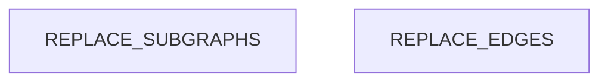

# Dependency Graph

<!-- ORACLE:INSTRUCTIONS
This doc is filled by the structure-analyst.
Maps module-level dependencies, identifies hubs, detects layer violations.

Primary data sources (in order of preference):
1. CodeWiki: .codewiki-cache/dependency_graph.json (LLM-powered, most accurate)
2. Tree-sitter: .tree-sitter-results.json (AST-based)
3. Grep: fallback for import statements

Tools:
- CodeWiki dependency graph (preferred): nodes + edges with semantic understanding
- Tree-sitter import graph: import_graph.edges for AST-parsed imports
- Grep as fallback to find import/require/use statements
- LSP findReferences for verification
- Read files to determine layer assignment (presentation/business/data/infra)

CodeWiki dependency_graph.json structure:
- nodes: [{id, name, file_path, component_type}]
- edges: [{from, to, import, line}]

Tree-sitter data structure:
- import_graph.edges: list of {from, to, import, line} - the dependency edges
- hubs: list of {file, dependents} - files imported by many others
- files[PATH].imports: imports for each file
- files[PATH].exports: exports for each file
-->

## Module Dependencies

<!-- ORACLE:DEP_GRAPH
Build a Mermaid flowchart showing how modules depend on each other.
Group modules into subgraphs by layer.
Highlight hub files with the `hub` class (red fill).

Steps (use CodeWiki if available, else Tree-sitter, else Grep):

**If CodeWiki is available:**
```bash
# Load dependency graph
cat .codewiki-cache/dependency_graph.json | python3 -c "
import json, sys
from collections import defaultdict
d = json.load(sys.stdin)
# Group edges by module (directory)
module_deps = defaultdict(set)
for edge in d.get('edges', []):
    from_mod = '/'.join(edge.get('from', '').split('/')[:-1])
    to_mod = '/'.join(edge.get('to', '').split('/')[:-1])
    if from_mod and to_mod and from_mod != to_mod:
        module_deps[from_mod].add(to_mod)
for mod, deps in sorted(module_deps.items()):
    print(f'{mod} -> {list(deps)}')
"
```

**If Tree-sitter (fallback):**
1. Read `.tree-sitter-results.json` and use `import_graph.edges`
2. Group by directory/module to get module-level deps (not file-level)

**If Grep only:**
3. Grep for import statements across all source files

Then:
4. Assign each module to a layer
5. Draw edges from importer → imported
6. Mark hubs with :::hub (use CodeWiki edges or tree-sitter `hubs` array)

Flowchart syntax:
```
flowchart TD
    subgraph LayerName["Display Name"]
        ModuleId[Module Name]
    end
    ModuleA --> ModuleB
    HubModule[Hub Name]:::hub
    classDef hub fill:#ff6b6b,stroke:#c92a2a,color:#fff
```

CodeWiki edge format: {"from": "src/utils.ts", "to": "src/types.ts", "import": "./types", "line": 5}
-->



## Hub Analysis

<!-- ORACLE:HUB_ANALYSIS
For each hub file (5+ dependents), document:
- Dependents: how many files import it
- Stability: how frequently it changes (use git log --oneline <file> | head -10)
- Risk: based on dependents × change frequency
  - Low: stable hub, rarely changes
  - Medium: moderate changes, several dependents
  - High: frequent changes OR many dependents
  - Critical: frequent changes AND many dependents

Tools (in order of preference):

**1. CodeWiki (most accurate):**
```bash
cat .codewiki-cache/dependency_graph.json | python3 -c "
import json, sys
from collections import Counter
d = json.load(sys.stdin)
dependents = Counter()
for edge in d.get('edges', []):
    dependents[edge.get('to')] += 1
print('Hubs (5+ dependents):')
for file, count in dependents.most_common():
    if count >= 5:
        print(f'  {file}: {count} dependents')
"
```

**2. Tree-sitter:** Use the `hubs` array from `.tree-sitter-results.json`

**3. LSP:** findReferences for verification

**4. Grep:** as fallback for import counting

**5. Bash:** git log --oneline --since="6 months ago" <file> | wc -l (for stability)

Hub data format: [{"file": "src/utils.ts", "dependents": 12}, ...]
-->

| File | Dependents | Recent Changes (6mo) | Stability | Risk |
|------|-----------|---------------------|-----------|------|
| REPLACE | REPLACE | REPLACE | REPLACE | REPLACE |

## Layer Violations

<!-- ORACLE:VIOLATIONS
A layer violation occurs when a lower layer imports a higher layer:
- Data layer importing from presentation layer
- Infrastructure importing from business logic
- Business logic importing from presentation

Steps:
1. From the dependency graph, check each edge direction
2. Flag any edge that goes from lower → higher layer
3. If none found, write "No layer violations detected."

If CodeWiki is available, use module_tree.json for layer assignment:
- Each module typically belongs to a layer based on path (e.g., api/ = presentation, services/ = business)
-->

REPLACE: violations found, or "No layer violations detected."

## Blast Radius

<!-- ORACLE:BLAST_RADIUS
For each hub, describe what would break if it changed.
Trace 2 levels deep:
1. Direct dependents (files that import the hub)
2. Indirect dependents (files that import direct dependents)

If CodeWiki is available, use call_graph.json for more precise impact:
```bash
cat .codewiki-cache/call_graph.json | python3 -c "
import json, sys
from collections import defaultdict
d = json.load(sys.stdin)
# Build reverse lookup
callers = defaultdict(list)
for rel in d.get('relationships', d.get('calls', [])):
    callers[rel.get('callee')].append(rel.get('caller'))
# For a target, find all callers
target = 'specific_function_name'
print(f'Direct callers of {target}:')
for caller in callers.get(target, []):
    print(f'  {caller}')
"
```

Present as a list per hub:
### hub-file.ts
- Direct: 8 files (list key ones)
- Indirect: ~15 files
- Risk: Changing exports would break all direct dependents
- Recommendation: Add tests before modifying, use deprecation warnings
-->

REPLACE: blast radius analysis per hub
