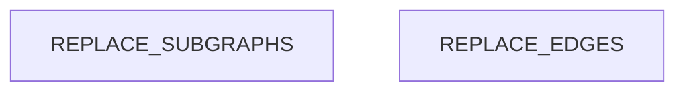

# Dependency Graph

<!-- ORACLE:INSTRUCTIONS
This doc is filled by the structure-analyst.
Maps module-level dependencies, identifies hubs, detects layer violations.

Tools:
- Tree-sitter import graph (from .tree-sitter-results.json): most accurate dependency data
- Grep as fallback to find import/require/use statements
- LSP findReferences for verification
- Read files to determine layer assignment (presentation/business/data/infra)

Tree-sitter data structure:
- `import_graph.edges`: list of {from, to, import, line} - the dependency edges
- `hubs`: list of {file, dependents} - files imported by many others
- `files[PATH].imports`: imports for each file
- `files[PATH].exports`: exports for each file
-->

## Module Dependencies

<!-- ORACLE:DEP_GRAPH
Build a Mermaid flowchart showing how modules depend on each other.
Group modules into subgraphs by layer.
Highlight hub files with the `hub` class (red fill).

Steps (use Tree-sitter data if available, fallback to Grep):
1. Read `.tree-sitter-results.json` and use `import_graph.edges` for precise dependencies
2. OR Grep for import statements across all source files as fallback
3. Group by directory/module to get module-level deps (not file-level)
4. Assign each module to a layer
5. Draw edges from importer → imported
6. Mark hubs with :::hub (use the `hubs` array from tree-sitter results)

Flowchart syntax:
```
flowchart TD
    subgraph LayerName["Display Name"]
        ModuleId[Module Name]
    end
    ModuleA --> ModuleB
    HubModule[Hub Name]:::hub
    classDef hub fill:#ff6b6b,stroke:#c92a2a,color:#fff
```

Tree-sitter edge format: {"from": "src/utils.ts", "to": "src/types.ts", "import": "./types", "line": 5}
-->



## Hub Analysis

<!-- ORACLE:HUB_ANALYSIS
For each hub file (5+ dependents), document:
- Dependents: how many files import it
- Stability: how frequently it changes (use git log --oneline <file> | head -10)
- Risk: based on dependents × change frequency
  - Low: stable hub, rarely changes
  - Medium: moderate changes, several dependents
  - High: frequent changes OR many dependents
  - Critical: frequent changes AND many dependents

Tools (in order of preference):
1. Tree-sitter: Use the `hubs` array from `.tree-sitter-results.json` - pre-calculated accurate counts
2. LSP: findReferences for verification
3. Grep: as fallback for import counting
4. Bash: git log --oneline --since="6 months ago" <file> | wc -l (for stability)

Hub data from Tree-sitter: [{"file": "src/utils.ts", "dependents": 12}, ...]
-->

| File | Dependents | Recent Changes (6mo) | Stability | Risk |
|------|-----------|---------------------|-----------|------|
| REPLACE | REPLACE | REPLACE | REPLACE | REPLACE |

## Layer Violations

<!-- ORACLE:VIOLATIONS
A layer violation occurs when a lower layer imports a higher layer:
- Data layer importing from presentation layer
- Infrastructure importing from business logic
- Business logic importing from presentation

Steps:
1. From the dependency graph, check each edge direction
2. Flag any edge that goes from lower → higher layer
3. If none found, write "No layer violations detected."

This is important for architectural health assessment.
-->

REPLACE: violations found, or "No layer violations detected."

## Blast Radius

<!-- ORACLE:BLAST_RADIUS
For each hub, describe what would break if it changed.
Trace 2 levels deep:
1. Direct dependents (files that import the hub)
2. Indirect dependents (files that import direct dependents)

Present as a list per hub:
### hub-file.ts
- Direct: 8 files (list key ones)
- Indirect: ~15 files
- Risk: Changing exports would break all direct dependents
- Recommendation: Add tests before modifying, use deprecation warnings
-->

REPLACE: blast radius analysis per hub
