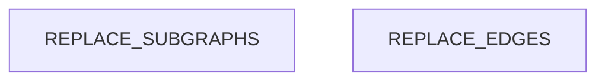

# Dependency Graph

<!-- ORACLE:INSTRUCTIONS
This doc is filled by the structure-analyst.
Maps module-level dependencies, identifies hubs, detects layer violations.

Tools:
- Grep to find all import/require/use statements in the codebase
- Group imports by source module to build adjacency list
- Count reverse references per file to identify hubs
- LSP findReferences for precise hub detection
- Read files to determine layer assignment (presentation/business/data/infra)
-->

## Module Dependencies

<!-- ORACLE:DEP_GRAPH
Build a Mermaid flowchart showing how modules depend on each other.
Group modules into subgraphs by layer.
Highlight hub files with the `hub` class (red fill).

Steps:
1. Grep for import statements across all source files
2. Group by directory/module to get module-level deps (not file-level)
3. Assign each module to a layer
4. Draw edges from importer → imported
5. Mark hubs with :::hub

Flowchart syntax:
```
flowchart TD
    subgraph LayerName["Display Name"]
        ModuleId[Module Name]
    end
    ModuleA --> ModuleB
    HubModule[Hub Name]:::hub
    classDef hub fill:#ff6b6b,stroke:#c92a2a,color:#fff
```
-->



## Hub Analysis

<!-- ORACLE:HUB_ANALYSIS
For each hub file (5+ dependents), document:
- Dependents: how many files import it
- Stability: how frequently it changes (use git log --oneline <file> | head -10)
- Risk: based on dependents × change frequency
  - Low: stable hub, rarely changes
  - Medium: moderate changes, several dependents
  - High: frequent changes OR many dependents
  - Critical: frequent changes AND many dependents

Tool: Grep — for each candidate file, search for import references
Tool: Bash — git log --oneline --since="6 months ago" <file> | wc -l (for stability)
-->

| File | Dependents | Recent Changes (6mo) | Stability | Risk |
|------|-----------|---------------------|-----------|------|
| REPLACE | REPLACE | REPLACE | REPLACE | REPLACE |

## Layer Violations

<!-- ORACLE:VIOLATIONS
A layer violation occurs when a lower layer imports a higher layer:
- Data layer importing from presentation layer
- Infrastructure importing from business logic
- Business logic importing from presentation

Steps:
1. From the dependency graph, check each edge direction
2. Flag any edge that goes from lower → higher layer
3. If none found, write "No layer violations detected."

This is important for architectural health assessment.
-->

REPLACE: violations found, or "No layer violations detected."

## Blast Radius

<!-- ORACLE:BLAST_RADIUS
For each hub, describe what would break if it changed.
Trace 2 levels deep:
1. Direct dependents (files that import the hub)
2. Indirect dependents (files that import direct dependents)

Present as a list per hub:
### hub-file.ts
- Direct: 8 files (list key ones)
- Indirect: ~15 files
- Risk: Changing exports would break all direct dependents
- Recommendation: Add tests before modifying, use deprecation warnings
-->

REPLACE: blast radius analysis per hub
